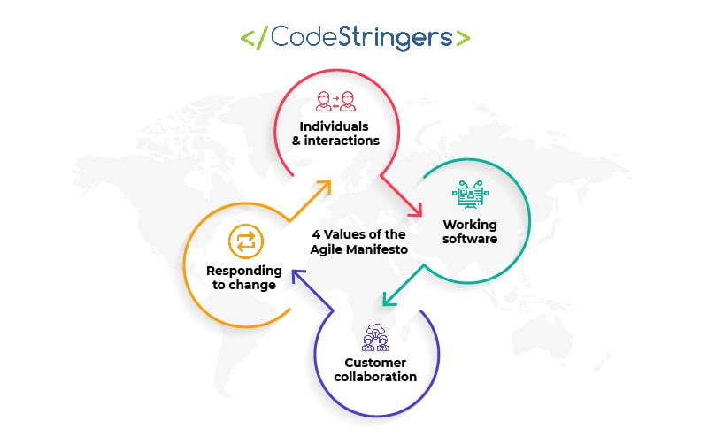
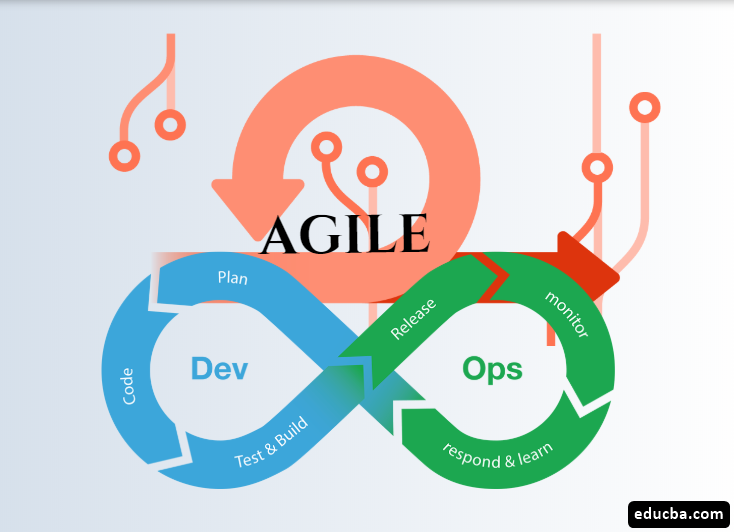
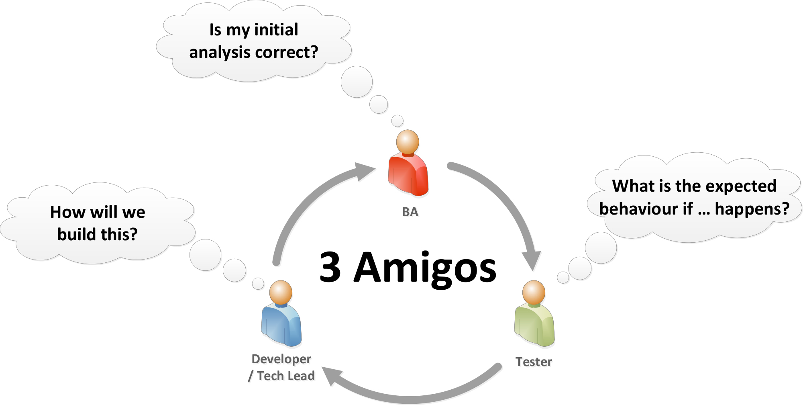
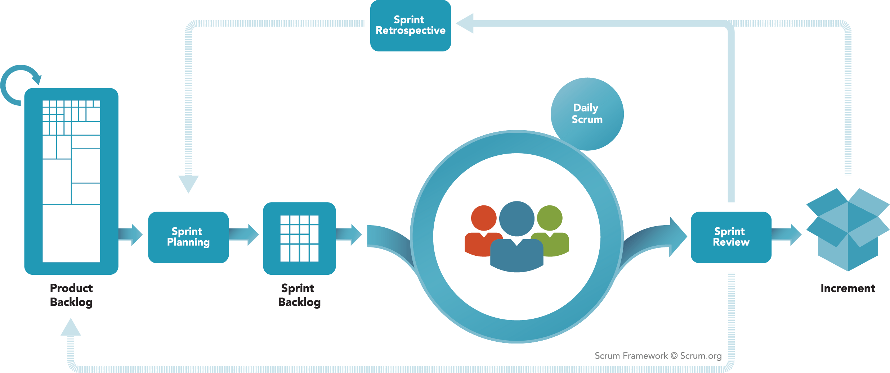

# tech201_agile_and_scrum
# What is Agile?
Agile is a software development philosophy which focuses on iterative releases of software and increased communication between all parties involved (developers, operators, business analyst).

The Agile manifesto consists of 4 values:
* Individuals and interactions over processes and tools
* Working software over comprehensive documentation
* Customer collaboration over contract negotiation
* Responding to change over following a plan

Agile can be broken down in more detail by looking at the 12 principles:
1) Highest priority is to satisfy customers through early and continuous delivery of valuable software
2) Welcome changing requirements, even late in development. Agile processes harness change for the customers competitive advantage
3) Deliver working software frequently, every couple weeks to months, with a preference for shorter time scales
4) Business people and developers must work together on projects
5) Build projects around motivated individuals - give the environment and support needed and trust them to get the job done
6) Most effective way to convey information is face-to-face
7) Working software is the primary measure of progress
8) Sustainable development should mean that sponsors, developers and users can maintain pace indefinitely
9) Continuous attention to technical excellence and design
10) Simplicity is key -> maximise amount of work not done
11) Best architectures, requirements and designs emerge from self- organising teams
12) At regular intervals -> reflect on how to be more effective, then tune and adjust behaviour accordingly

## How does agile alongside DevOps benefit a business?

* Faster time to market: Agile development allows teams to deliver software in small, incremental chunks, getting new features and improvements to customers faster.
* Increased adaptability to change: Agile methodologies prioritize flexibility, which allows teams to respond quickly to changes in customer requirements or market conditions.
* Improved collaboration and communication: Agile methodologies encourage collaboration and communication among cross-functional teams, which can lead to better decision-making and problem-solving.
* Improved customer satisfaction:  Agile development allows teams to get feedback from customers early and often, 
* Increased efficiency: Agile methodologies emphasize continuous improvement, which can lead to more efficient processes and better use of resources.
* Better quality of products: Agile methodologies promote testing and quality assurance throughout the development process, which can result in higher-quality products.

## The 3 Amigos

The three Amigo Principle says that the three Amigos; Business Analyst, Developers and Quality Analysts should get together in a meeting where:

* The Business Analyst details out each of the Business Requirements with the team.
* The members of the Quality Assurance Team discuss the Test Cases already created for these business requirements.
* The members of the Development Team discuss the architecture and the low-level design with the team.

The structure of the meeting can be summarised as such:

1) The meeting starts with the Business Analyst presenting the requirement to the attendees along with the design documents or wireframes.
2) As a next step, the attendees will be reviewing the requirement and providing feedback which will later be incorporated by the Business Analyst. The attendees will also point out to the ambiguities and gaps if any. The Business Analyst is also expected to remove the ambiguities.
3) Once the requirement is groomed enough and the attendees have no more feedback or open questions, the requirement is marked as ‘Ready’.
4) Next, the test cases are presented to the Attendees just like the requirements.
5) The attendees will now be reviewing the test cases and providing feedback. The QA member will incorporate all the suggestions provided. The Attendees would also point to the missed test cases and the edge case scenarios.
6) The next step is to look at the dependencies and pre-requisites that might have come out during the session.
7) The dependencies are determined and the action items are created and assigned to the relevant team member. Similarly, the tasks for pre-requisites are created and assigned.
8) All the artifacts (Requirement, Test cases, tasks, dependencies) mentioned above should be kept in a Project Management Tool like JIRA so that everyone can easily access them.
9) If there are too many review comments, the Business Analyst and the Quality Assurance Engineer may choose to incorporate them after the session.

In summary, the purpose of the 3 Amigos meeting is to remove uncertainty in the development process, and to make sure that all team members know what the expectations are

# What is scrum?
Whereas agile is a development philosophy, scrum is a methodology/framework which aims to put the ideas of agile into an actionable framework.

